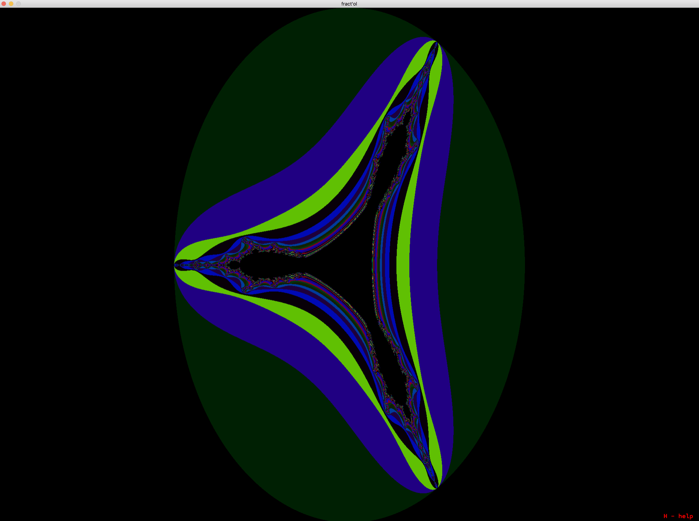

# fractol
Fract'ol 42 Project

						Usage :  ./fractol [fractol_name]
 
		---> julia
		---> mandelbrot
		---> mandelbar
		---> b_ship (burning ship)
		---> p_buffalo (perpendicular buffalo)
		---> pb_ship (perpendicular burning ship)
		---> p_mandelbrot (perpendicular mandelbrot)
		---> c_mandelbrot (celtic mandelbrot)

  

